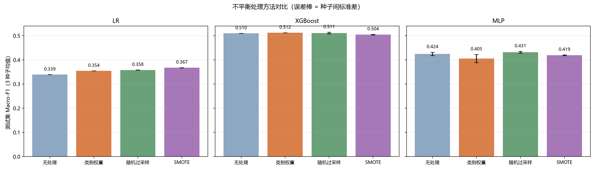
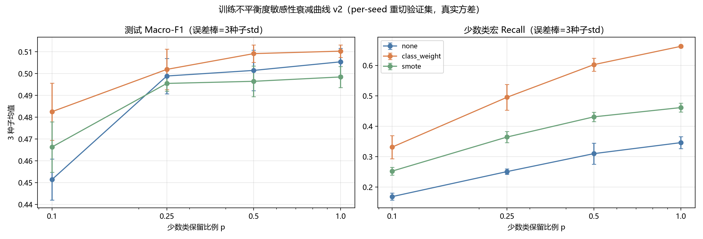
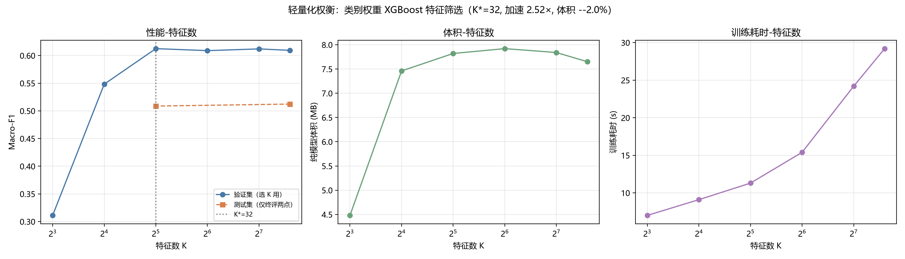
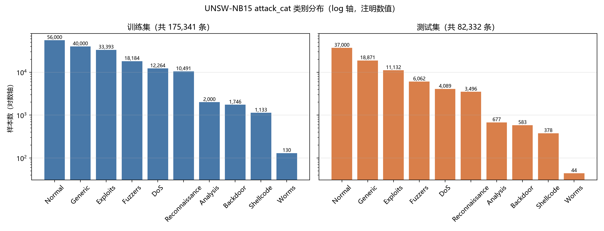

# 面向类别不平衡的网络入侵检测方法比较与轻量化改进研究

> 黄浩（北京邮电大学 信息与通信工程学院）
>
> **预印本**：已发布 ChinaXiv（2026-09-07）· DOI [10.12074/202609.00078](https://doi.org/10.12074/202609.00078) · ChinaXiv:202609.00078V1
> **状态**：实验封板 · 论文第一版完成 · 证据链全量入库
> **证据链总索引**：[`EVIDENCE-CHAIN.md`](EVIDENCE-CHAIN.md) —— 论文每个主张 → 报告 → CSV → 脚本四层可溯源

**[核心结果](#核心结果) · [工程规模](#工程规模) · [复现](#复现) · [质量保障](#质量保障)**

## 一句话简介

在统一防泄漏协议下，对类别不平衡处理方法（类别权重 / ROS / SMOTE）在 UNSW-NB15 上做
3 模型 × 4 方法 × 3 种子的受控系统比较（36 组），并引入验证集阈值校准与特征筛选轻量化
两项扩展对照、四项稳健性检验（含针对确定性模型的切分方差补测）。全部结论可溯源、
经三轮独立对抗审计闭环。

## 核心结果

| 发现 | 数字 |
|---|---|
| 方法排序不存在普适最优，稳定性依赖模型 | 选型分割间 Kendall τ：LR +1.0 / XGBoost −1.0 / MLP +0.333 |
| 全项目最高 Macro-F1 来自零重训练阈值校准 | **0.5436 ± 0.0063**（最差种子 0.5367，超过全部 36 个训练期格子） |
| 特征筛选 = 加速换精度（主指标噪声内） | 训练加速 2.67×，Macro-F1 −0.0022（切分方差内），体积不降反增 |
| 少数类召回对训练不平衡度本身高度敏感 | 类别权重宏 Recall 0.663 → 0.331（训练少数类降至 10%） |

<p align="center">
  
  <br>
  
</p>

<p align="center">
  
  
</p>

## 工程规模

| 指标 | 数值 |
|---|---|
| 实验脚本 | 15 个（`01_eda` → `14_attribution_summary` + `resplit.py` 方差补测协议） |
| 主实验格子 | 36 组（3 模型 × 4 方法 × 3 种子），全部落盘 config + metrics |
| Python 代码 | 约 3000 行 / 20 个文件 |
| 报告目录 | 9 个（week1–week6 + week5_v2 + redteam 对抗审计台账） |
| 论文插图 | 9 张（PNG 200 dpi） |
| 审计发现 | 37 项，全部闭环留痕 |

## 仓库结构

```
├── EVIDENCE-CHAIN.md      证据链总索引（主张→报告→CSV→脚本 全映射）★ 从这里开始
├── src/                   01-14 号实验脚本 + resplit.py（方差补测协议）
├── configs/               冻结超参数（单一来源）
├── reports/               全部证据入库（week1-6 分周 + redteam 对抗审计台账）
│   ├── week1-2/           数据核验、EDA、预处理、基线、划分重叠审计
│   ├── week3/             36 组主实验全表（Macro-F1 / BA / 每类 Recall / 开销）
│   ├── week4/             误差归因（逐条行哈希）、研究问题回答 v3
│   ├── week5/ week5_v2/   轻量化 + 方差补测 v2 报告与底层 CSV
│   ├── week6/             稳健性检验（τ/阈值/取整/衰减）+ 预注册文档
│   └── redteam/           三轮独立对抗审计台账（37 项问题闭环留痕）
├── figures/               论文全部插图（PNG 200dpi）
├── paper/chapters/        论文正文各章（Markdown）
├── data/README.md         UNSW-NB15 获取方式、SHA-256 指纹与许可引用
├── CITATION.cff           引用元数据
└── PROGRESS.md            逐周工作检查清单（完整过程记录）
```

> **本仓库不含**原始数据集（体积大且第三方所有）、预印本 PDF/DOCX 成品、
> 以及任何个人身份材料。复现所需的一切证据以 `reports/` 下的报告与 CSV 为准。

## 复现

环境：Windows 11 · Python 3.13.15 · scikit-learn 1.9.0 · XGBoost 3.4.1 ·
imbalanced-learn 0.14.2（完整锁定见 `requirements.lock.txt`）。

```bash
python -m venv .venv
.venv\Scripts\activate
pip install -r requirements.txt -i https://pypi.tuna.tsinghua.edu.cn/simple

python src/01_eda.py                # 数据核验与 EDA
python src/02_preprocess.py         # 防泄漏预处理（先划分后拟合）
python src/05_run_experiments.py    # 36 组主实验（幂等可续跑）
python src/07_error_analysis.py     # 误差归因
python src/08_lightweight.py        # 轻量化
python src/13_imbalance_decay.py --v2   # 稳健性 + 方差补测
# 完整命令序列（14 个脚本 + 参数说明）见 EVIDENCE-CHAIN.md
```

防泄漏三原则（违反即全部作废，脚本层断言）：
① 重采样/标准化只在训练划分上 fit；② 验证集只用于选型；③ 官方测试集冻结只终评。

数据获取：UNSW-NB15 官方划分集（来源、许可证与引用要求见 [data/README.md](data/README.md)），
下载后放 `data/raw/`。

## 质量保障

- **三轮独立对抗审计 + 一次专项复攻**：审计者与作者隔离、只读证据文件、结构化返回
  问题清单（37 项发现全部闭环：数字张冠李戴、选型违规、过度概括、确定性种子坍缩等，
  台账 `reports/redteam/`）
- **预注册**：排序一致性 τ 检验的假设与判定标准先于计算冻结
- **可复现**：超参单一来源（`configs/`）、依赖精确锁定、每格实验落盘 config+metrics
- **诚实报告**：负结果（特征筛选无法压缩树模型体积、少数类召回对不平衡度本身敏感）
  与全部局限（第 7 节）随论文公开

## 成果公开

- **预印本**：ChinaXiv:202609.00078 · DOI [10.12074/202609.00078](https://doi.org/10.12074/202609.00078)（2026-09-07 公开）
  引用格式：黄浩. 面向类别不平衡的网络入侵检测方法比较与轻量化改进研究.
  中国科学院科技论文预发布平台, 2026. DOI: 10.12074/202609.00078
- **补充材料**：全部图表与关键实验数据 CSV（随预印本提交，进 Science Data Bank）
- **过程记录**：[PROGRESS.md](PROGRESS.md)（逐周检查清单与审计修复史）

```bibtex
@misc{huang2026imbalanceids,
  title  = {面向类别不平衡的网络入侵检测方法比较与轻量化改进研究},
  author = {Huang, Hao},
  year   = {2026},
  doi    = {10.12074/202609.00078},
  url    = {https://chinaxiv.org/abs/202609.00078},
  note   = {ChinaXiv preprint}
}
```
